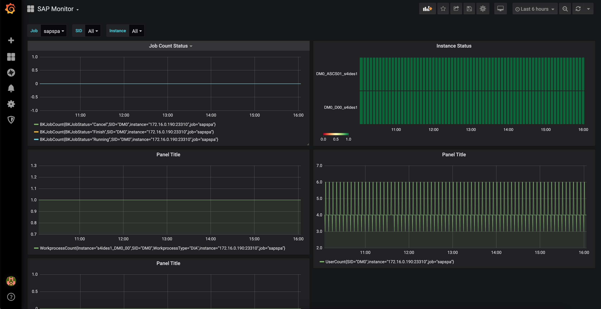
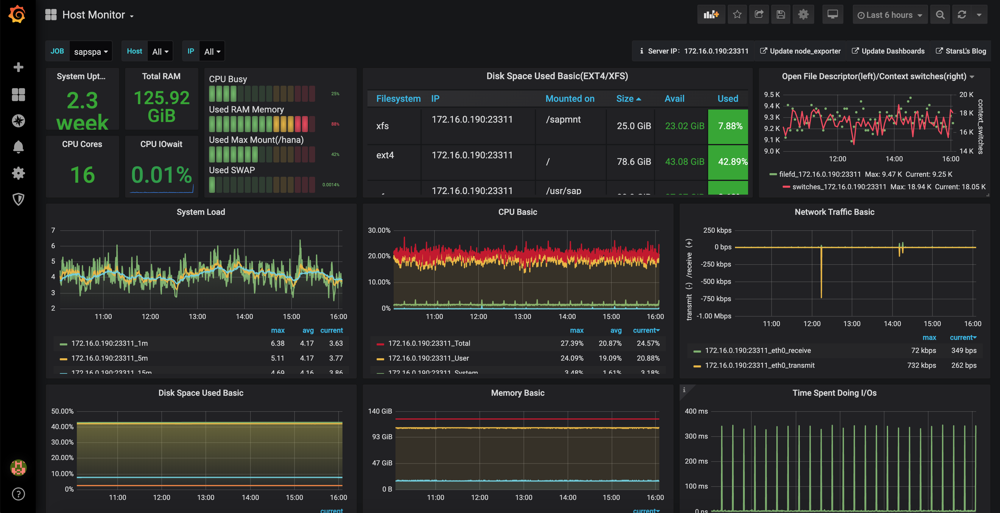
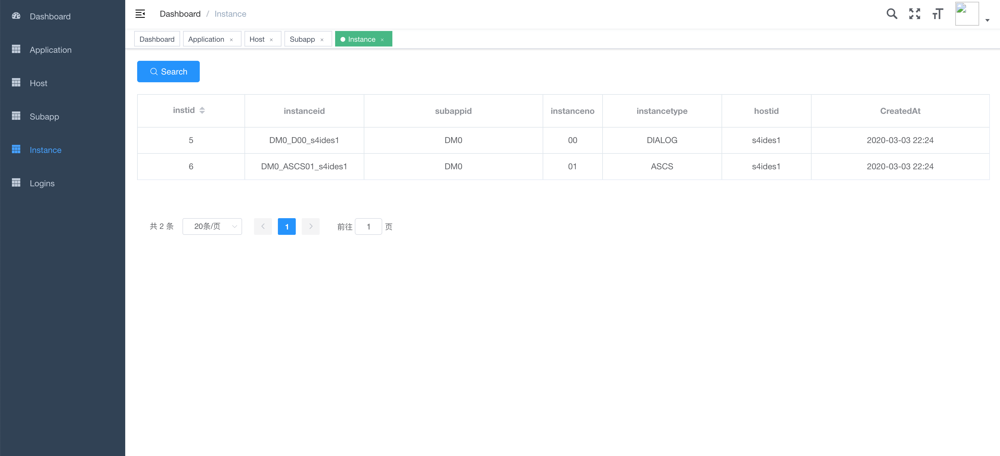

# sapspa

## SAP monitor and analysis bundle project
<font color=red size=5 face="微软雅黑">Reserved PORT **23300 - 23399**</font>
## Screenshots
SAP Monitor

Host Monitor

Dashboard


## Installation
assume you have a master machine which will run SAPSPA master app and IP address is ***{MASTER_IP}***
### 1. Download Code
```
wget https://github.com/redbearder/sapspa/archive/latest.tar.gz 
tar zxvf latest.tar.gz
```
### 2. Installation on Master
* With Script

```
cd sapspa/script
bash start_master.sh --master=MASTER_IP
```
* With Docker

```
cd sapspa/docker-compose
docker-compose -f docker-compose-master.yml up -d
```
### 3. Installation in Agent
* With Script

```
cd sapspa/script
bash start_agent.sh --master=MASTER_IP
```
* With Docker

```
cd sapspa/docker-compose
sed -i "s?192.168.50.210?MASTER_IP?g" docker-compose-agent.yml
docker-compose -f docker-compose-agent.yml up -d
```

## Usage
* Dashboard [http://***MASTER_IP***:23380/]()
* Grafana [http://***MASTER_IP***:23330/]()
* Kibana [http://***MASTER_IP***:23356/]()
* Prometheus [http://***MASTER_IP***:23390/]()
* Consul [http://***MASTER_IP***:23345/]()

## Task list
### 1. backend future
- [ ] backend app list
- [x] backend subapp list
- [x] backend host list
- [x] backend instance list and relation redirect
- [ ] admin and backend basic auth
- [x] 23381 port support /api /mapi
- [x] 23380 port support /admin
- [x] single instance start/stop control
- [x] app all instance start/stop control by sequence
- [ ] instance move
- [ ] instance copy
- [ ] instance auto fix rules panel

### 2. agent future
- [x] common readtable rfc function , port 23310
- [x] usercount status data
- [x] workprocess status
- [x] background job status **_V_OP_**
- [x] dump status
- [x] instance status
- [ ] transport status
- [ ] rfc resource status
- [x] Consul, port 8300: 23340, 8302: 23342, 8301: 23341, 8600: 23346, 8500: 23345
- [x] node_exporter, port 23311
- [x] single instance start/stop control
- [x] app all instance start/stop control by sequence
- [ ] instance move and status api
- [ ] instance copy and status api
- [ ] auto fix atom operation: kill os process
- [x] pull st03 workload monitor data to prometheus
- [x] pull st03 workload monitor data to es
- [x] pull st02 workload monitor data to prometheus
- [x] pull st02 workload monitor data to es
- [ ] pull db02 workload monitor data to prometheus
- [ ] pull db02 workload monitor data to es
- [ ] TBD: stad

### 3. build apps
- [x] es, port 23392, 23393
- [x] kibana, port 23356
- [x] filebeat and live reload
- [x] prometheus, port 23390

### 4. grafana dashboard
- [x] usercount list and user type dist
- [x] workprocess list and type
- [x] background job status
- [x] dump status SNAP
- [x] instance status
- [ ] transport status
- [ ] rfc resource status
- [x] os monitor
- [ ] mysql monitor
- [ ] es monitor
- [x] grafana, port 23330
- [ ] alert

### 5. docker-compose deploy script
- [x] master
- [x] agent

### 6. bash deploy script
- [x] agent
- [x] master

### 7. unitest and ci
- [ ] todo...

### 8. hana database monitor and report
- [ ] todo...


```
maybe some code here

```